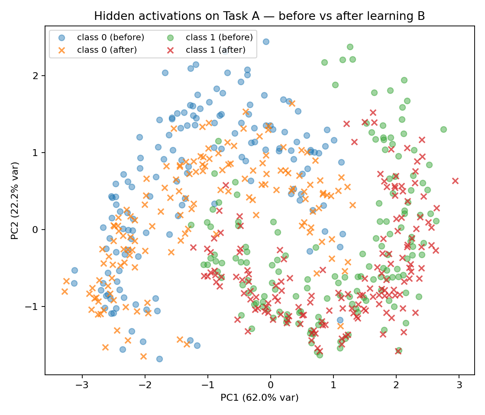
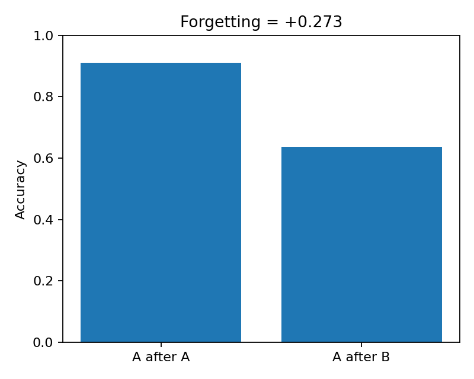

# Memory Geometry: Replay Reduces Representational Drift

This project shows how **replay** stabilizes neural representations in a continual-learning setting (Task A to Task B).  
We train a small MLP on two 2-D tasks with different **input geometries** (moons vs rotated blobs), then analyze the  
**hidden-layer geometry** before/after Task B using PCA and **subspace overlap** (principal angles).

## Project structure
mem-geometry/
├── src/
│   ├── data.py
│   ├── model.py
│   ├── train.py
│   ├── train_replay.py
│   ├── analyze.py
│   └── utils.py
├── scripts/
│   ├── run_ab_no_replay.ps1
│   └── run_ab_replay.ps1
├── experiments/
│   └── ab_replay/
│       ├── metrics.csv
│       └── figures/
├── .gitignore
├── LICENSE
└── README.md

## Results

- **Without Replay:** strong representational drift (low overlap between hidden subspaces)
- **With Replay:** stable representations, subspace cosine ≈ 0.96

### Visual results
**Geometry PCA:**


**Forgetting comparison:**



## Run the experiments

```bash
python -m src.train
python -m src.train_replay
python -m src.analyze --indir experiments/ab_replay --seed 0 --k 5
